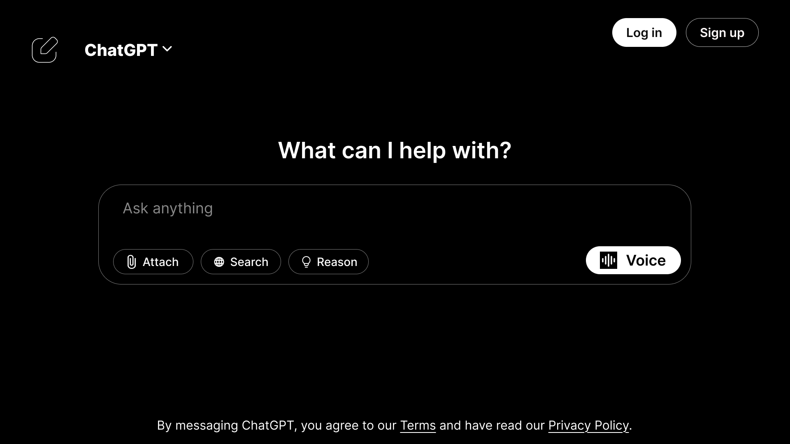
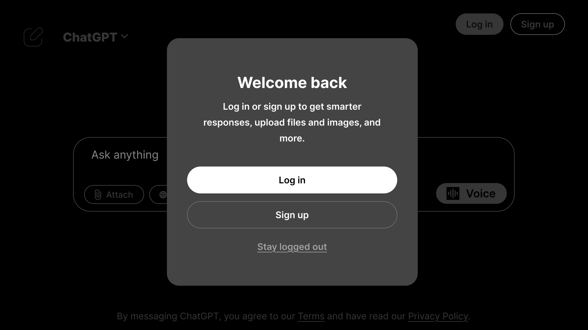
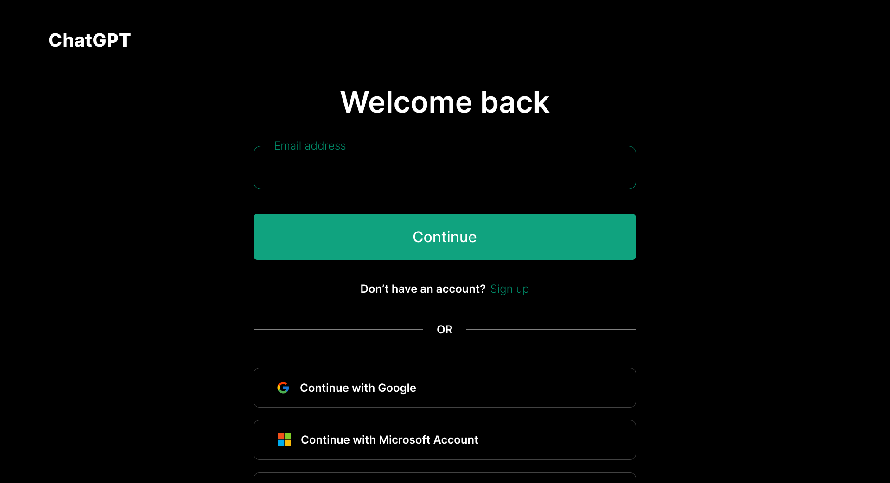
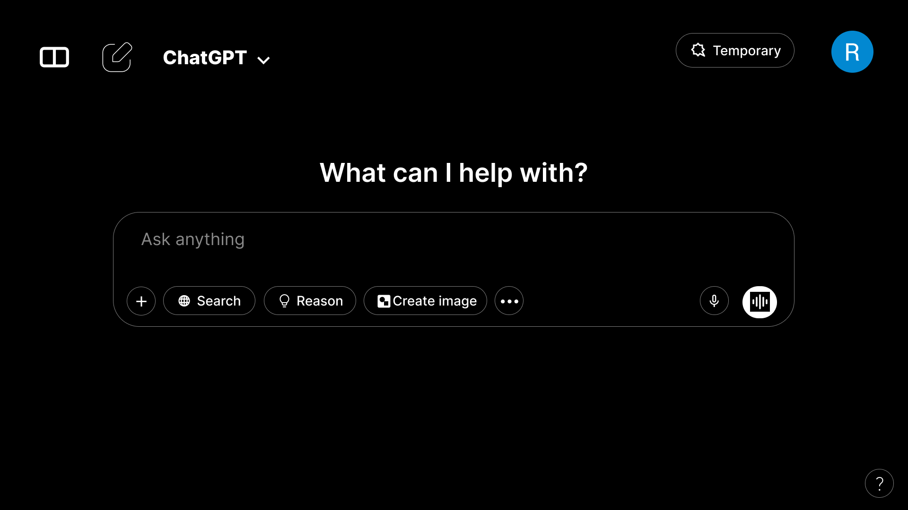

# 💬 ChatGPT Interface UI – Figma Design

This is a custom UI/UX redesign of ChatGPT’s interface, created using Figma. It includes the landing screen, login/signup alert, login page, and logged-in chat interface with basic prototyping.

---

## 🧠 What’s this project about?

The purpose of this project is to reimagine the ChatGPT interface with a modern, dark-theme aesthetic and clear, minimal interaction flow. It was created to practice real-world design thinking and prototyping in Figma.

---

## ✨ Features Designed

- 🚀 Landing Page with “Log In” & “Sign Up” options  
- 🔐 Login/Signup Alert Modal  
- 🧾 Login Page with credentials input  
- 💬 Logged-In Chat Interface  

---

## 🛠 Tools Used

- 🎨 Figma (Design & Prototyping)  
- 📷 PNG Screenshots (for preview)  
- 📄 PDF Prototype (for offline view)

---

## 🔗 View the Prototype

👉 [Click here to open in Figma](https://www.figma.com/design/oiov3GAyWBTpg500IO98be/UI-UX-Projects?t=xaEMLWhxIeBAEpje-0)

---

## 🖼 Screenshots

### Landing Page

### Login/Signup Alert

### Login Page

### Logged-in Interface

---

## 📄 Full Prototype (PDF)

Download or view the full prototype here: [prototype.pdf](./prototype.pdf)

---

## 📬 Contact

Designed by **Raunak Tuladhar**  
📧 tuladharraunak1313@gmail.com  
🔗 [LinkedIn](https://www.linkedin.com/in/raunak-tuladhar)

---

