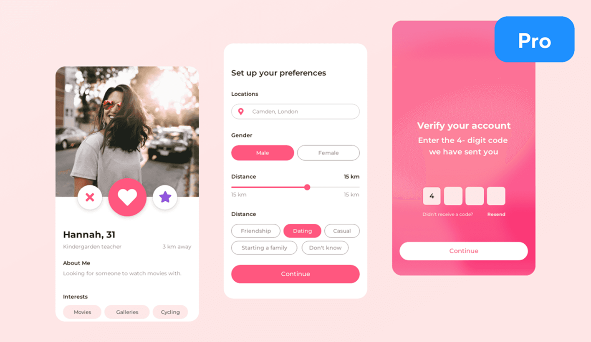
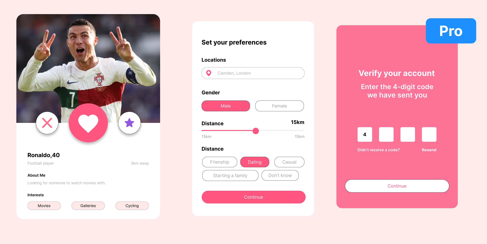

# 💖 Dating App UI – Figma Design

This is a UI/UX design prototype for a modern dating app created using Figma. It includes user profile display, preference settings, and account verification flow.

---

## 🧠 What’s this project about?

The goal of this project is to design a clean, user-friendly interface for a dating app. It focuses on simple navigation, visually engaging elements, and a smooth onboarding experience.

---

## ✨ Features Designed

- 👤 Profile Screen (with like/dislike actions)
- ⚙️ Preference Selection (location, gender, distance)
- ✅ Account Verification with 4-digit code

---

## 🛠 Tools Used

- 🎨 Figma (Design & Prototyping)
- 📷 PNG Screenshots (for showcase)
- 📄 PDF Prototype (for full walkthrough)

---

## 🔗 View the Prototype

👉 [Click here to open in Figma](https://www.figma.com/design/O0ptXy9ujBfjapyx0EbTQ8/uiux-practice?t=xaEMLWhxIeBAEpje-0)

---

## 🖼 Screenshots

### Demo Screen

### Final Product

---

## 📄 Full Prototype (PDF)

Download or view the complete prototype here: [prototype.pdf](./prototype.pdf)

---

## 📬 Contact

Designed by **Raunak Tuladhar**  
📧 tuladharraunak1313@gmail.com  
🔗 [LinkedIn](https://www.linkedin.com/in/raunak-tuladhar)

---

