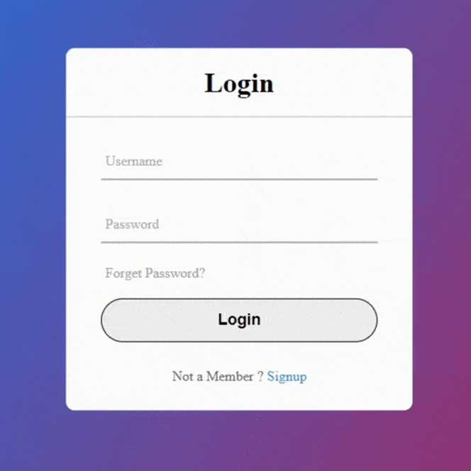
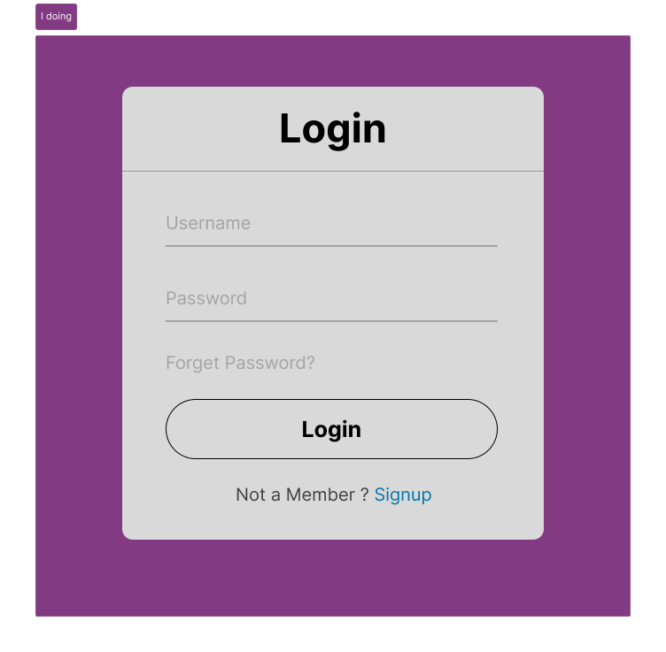

# 🔐 Login Interface UI – Figma Design

This project features a clean and simple login screen UI built using Figma. It includes fields for username and password, a "Forgot Password?" link, and an option to navigate to the signup page.

---

## 🧠 What’s this project about?

The login screen was designed to practice minimal form UI with proper hierarchy and usability in mind. The goal was to maintain clarity and simplicity while making it visually appealing.

---

## ✨ Features Designed

- 📥 Username and Password fields  
- 🔗 “Forgot Password?” link  
- ➕ Option to Sign Up if not registered  
- ✅ Minimal modern card layout

---

## 🛠 Tools Used

- 🎨 Figma (Design & Prototyping)
- 📷 PNG Screenshot
- 📄 PDF Prototype

---

## 🔗 View the Prototype

👉 [Click here to open in Figma](https://www.figma.com/design/O0ptXy9ujBfjapyx0EbTQ8/uiux-practice?t=xaEMLWhxIeBAEpje-0)

---

## 🖼 Screenshot

### Demo Screen

### Final Product

---

## 📄 Full Prototype (PDF)

View or download the complete prototype: [prototype.pdf](./prototype.pdf)

---

## 📬 Contact

Designed by **Raunak Tuladhar**  
📧 tuladharraunak1313@gmail.com  
🔗 [LinkedIn](https://www.linkedin.com/in/raunak-tuladhar)

---
